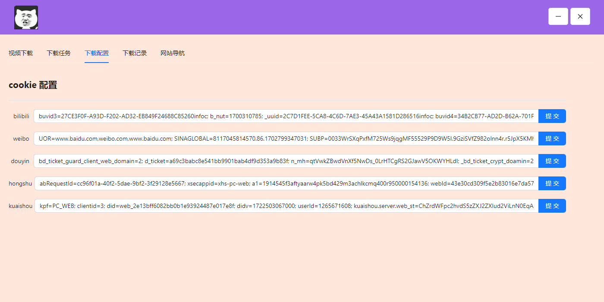

# 一个win 小工具 
```
油猴脚本xhr-hook.js 能够拦截http response 获取响应数据 直接下载视频/图片 或者发送到自己的后端接口

采用rust tauri 制作的 配置cookie即可使用 下载的文件在安装目录 ./download/
支持的平台
    抖音 视频/图片/直播/主页视频 /live图
    微博 视频/图片/主页视频/主页图片/主页精选/
    b站  视频(下载视频需要ffmpeg)/主页视频(开发中)直播 
    红书 视频/图片/主页视频/主页图片/live图
    快手 视频/图片/主页视频/主页图片/直播

使用rust 异步多线程能够同时开始多个任务下载 多个任务以换行开始
```





